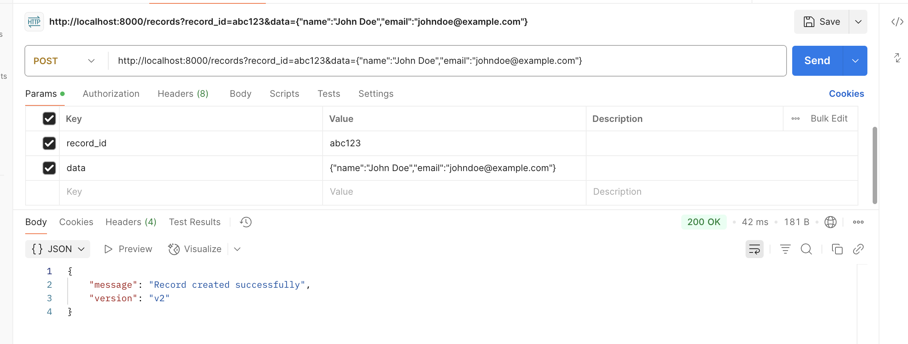
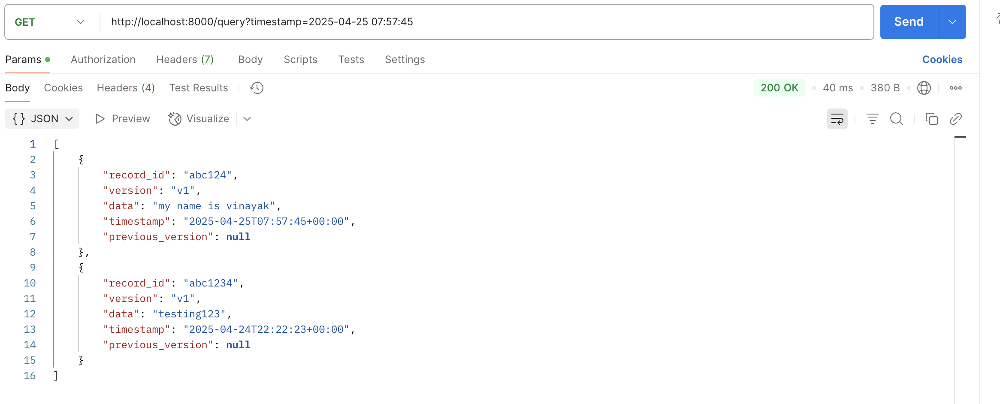
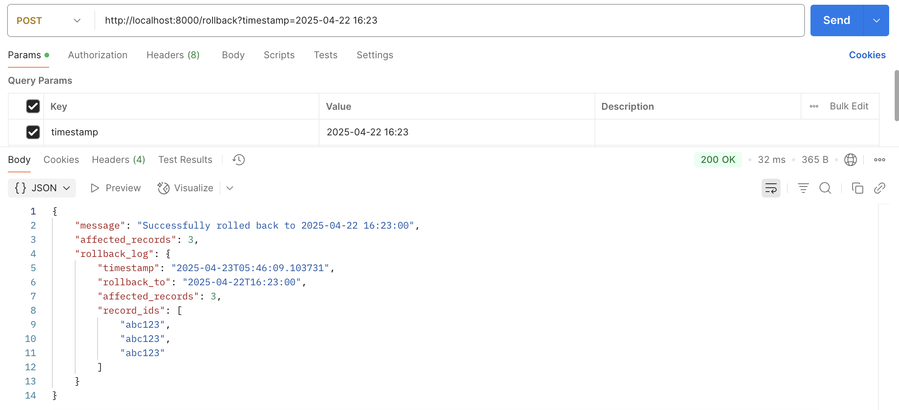

# Temporal Vault

A Time-Traveling Database API that allows querying data from any past point in time.

## Features

- Retrieve data as it was at any past timestamp
- Compare how data evolved over time
- Rollback to any previous state without restoring backups
- Efficient storage using append-only logging & snapshots
- Optimized querying with B-trees and indexes

## Tech Stack

- Backend API: FastAPI (Python)
- Database: PostgreSQL + TimescaleDB
- Storage Engine: Append-only log (PostgreSQL JSONB)
- Query Optimization: B-tree indexes + Redis cache
- Containerization: Docker
- Monitoring: Grafana + Prometheus

## Setup


1. Set up environment variables:

```bash
cp .env.example .env

```

2. Run the application:

```bash
docker compose up
```

## API Endpoints

- `POST /records?record_id=abc123&data={"name":"John Doe","email":"johndoe@example.com"}` -Records data

- `GET /query?timestamp={timestamp}` - Query data at a specific timestamp

- `POST /rollback` - Rollback database to a specific timestamp

- `GET /compare?start={timestamp}&end={timestamp}` - Compare data between two timestamps

## Development

The project uses:

- SQLAlchemy for database operations
- Redis for caching
- Prometheus for monitoring
- Docker for containerization

